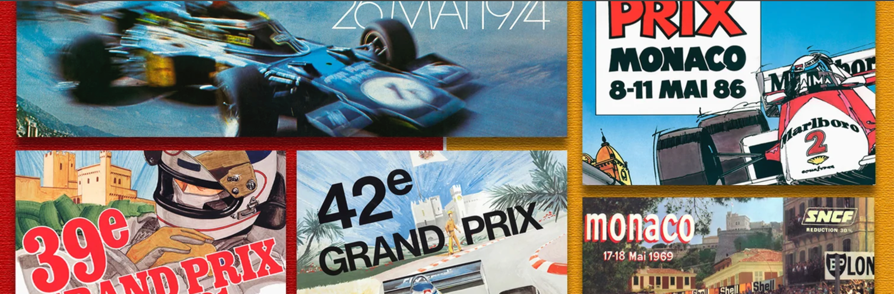
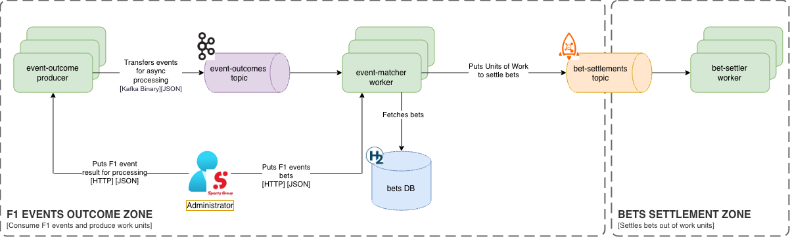

# F1 Bets

A small event-driven betting platform built as a technical interview exercise. It simulates settling
sports bets (an F1 race winner market, because I am an old F1 fan) as soon as the race outcome is known: an outcome is published,
matched against the open bets for that event, and the settlement result is delivered downstream — all
asynchronously, via Kafka and RocketMQ.

# About the AI usage

I intentionally coded 2/3 of the application without AI, since I still enjoy writing code by hand.
So, I decided to use this task as an opportunity to code what I want in a relaxed mode.
AI was used to generate tests, documentation and Docker files.
In case you want to know how I usually code with AI, you can check the [ai](ai) folder for a simplified version of my AI harness, which I use regularly for development.
Please bear in mind that those scripts are lightweight versions of my custom scripts, which I don't want to share in public.
My AI-development tactics are described in [How to develop with AI - General rules](resources/documents/How__to_develop_with_AI_General_rules.pdf)

## Architecture



The total implementation took a bit longer than 90 min. I wanted to deal with a tradeoff between the system completeness and suggested time limits.
At first glance, I wanted to create just a modular monolith or just two small microservices to save some time.
But after short thinking out loud, I shifted to a different solution - 3 separate services. That approach would make the whole experiment cleaner.
Each service has its own role and can scale separately.

`event-outcome-producer` - gets race results, can be scaled to increase durability to process multiple sporting events' results simultaneously.
`event-matcher-worker` - for every race outcome, has one responsibility: produces "units of work" - batches with several bets (1-10-100...) and the race result.
`bet-settler-worker` - picks a "unit of work" from the topic and settles all the bets inside. Each unit's processing is protected from duplicate processing with an idempotency key check.

So each service has its own responsibility and is an independent Spring Boot application, internally structured as a **hexagonal
(ports & adapters) architecture** (`adapter.in` / `adapter.out` / `application` / `usecase` packages),
and communicates with the others only through messaging — never direct HTTP calls.

| Module | Responsibility | Exposes |
|---|---|---|
| [`event-outcome-producer`](./event-outcome-producer) | REST endpoint to publish an event outcome (race winner) | `POST /api/v1/event-outcome` → Kafka topic `event-outcomes` |
| [`event-matcher-worker`](./event-matcher-worker) | Consumes outcomes, matches them against stored bets, persists results via a transactional **outbox**, and dispatches settlement work units | REST endpoint `PUT /api/v1/bet` to register bets; H2 (Spring Data JDBC) for storage |
| [`bet-settler-worker`](./bet-settler-worker) | Consumes settlement work units from RocketMQ and finalizes each bet's outcome | RocketMQ topic `bet-settlements`; H2 (Spring Data JDBC) for storage |

## About the Hexagonal architecture

Each module uses Hexagonal architecture to decouple its internal implementation from its external API.
Yes, I know that it's a bit overkill for a small project like this, but it's a good practice in general.
I have used it in my own projects many times, and it's a good way to keep the code clean and maintainable.
Traditional layered architecture saves some time at the very beginning, but as the project grows, it becomes harder to maintain and extend.
Modern Hexagonal architecture gives me more freedom to choose the right abstractions for each module.
Changes become cheaper and easier to implement with AI harnesses.

## Tech stack

- **Java 21+** / **Spring Boot 4**
- Spring Web MVC, Spring Kafka, Spring Data JDBC, Spring Modulith (events)
- Apache Kafka & Apache RocketMQ as messaging backbones
- H2 (in-memory) as the persistence store for each worker
- MapStruct + Lombok
- Docker / Docker Compose

## Getting started

### Prerequisites
- Docker & Docker Compose
- JDK 21+ and Maven (only needed if you want to build/run modules outside Docker)

### Run everything with Docker Compose

```bash
docker compose up --build
```

This starts Kafka, RocketMQ (name server + broker), and all three application modules. Use `--build` (or
`docker compose up --build --force-recreate`) whenever you've changed code, since Compose otherwise reuses
previously built images.

| Service | URL |
|---|---|
| event-outcome-producer | http://localhost:8081 |
| event-matcher-worker | http://localhost:8082 |
| bet-settler-worker | *(no HTTP API, consumes from RocketMQ only)* |
| Kafka | localhost:9092 |
| RocketMQ name server | localhost:9876 |

### Run a single module locally

```bash
cd event-matcher-worker
mvn spring-boot:run
```

Each module can also be built/tested independently with `mvn clean verify` from its own directory, or all
at once from the repository root.

## Trying it out

**1. Register a bet** on `event-matcher-worker`:

```bash
curl -X PUT http://localhost:8082/api/v1/bet \
  -H "Content-Type: application/json" \
  -d '{
        "userId": "11111111-1111-1111-1111-111111111111",
        "eventId": "22222222-2222-2222-2222-222222222222",
        "eventMarketId": "33333333-3333-3333-3333-333333333333",
        "amount": 10.50
      }'
```

**2. Publish the event outcome** on `event-outcome-producer`:

```bash
curl -X POST http://localhost:8081/api/v1/event-outcome \
  -H "Content-Type: application/json" \
  -d '{
        "eventId": "22222222-2222-2222-2222-222222222222",
        "eventName": "Monaco Grand Prix",
        "eventWinnerId": "33333333-3333-3333-3333-333333333333"
      }'
```

`event-matcher-worker` consumes this from Kafka, matches it against the bet placed in step 1, records the
result via its transactional outbox, and forwards a settlement work unit to `bet-settler-worker` over
RocketMQ, which then finalizes the bet.

## Automatic load
You can use [load_bets.py](scripts/load_bets.py) to generate load for the system.
By default, it generates 1000 bets for three events (1k bets per event).
You can change the number of events and bets by changing the `BETS_PER_EVENT` and `EVENTS_COUNT` variables in the script.

## Project layout

```
f1-bets/
├── event-outcome-producer/   # REST API → publishes event outcomes to Kafka
├── event-matcher-worker/     # Kafka consumer → matches bets → transactional outbox → RocketMQ producer
├── bet-settler-worker/       # RocketMQ consumer → settles bets
└── compose.yaml              # Full local stack (Kafka, RocketMQ, all services)
```

## Notes for reviewers

- Only `event-matcher-worker` owns its own H2 database and uses **Spring Data JDBC** rather than JPA/Hibernate — schema is defined explicitly in `schema.sql`.
- `event-matcher-worker` implements the **transactional outbox pattern** so that persisting a bet match and
  reliably dispatching the downstream RocketMQ message never fall out of sync.
- All inter-service communication is asynchronous (Kafka / RocketMQ).
- I have left `bet-settler-worker` output open (it just prints the result in the console). In prod-grade systems there could be persistence operation or futher async call.
- No dead-letter topic is configured for either broker — skipped for simplicity. Ideally there should be two: one on the Kafka side (`event-outcomes`) and one on the RocketMQ side (`bet-settlements`), so a message that keeps failing gets parked for inspection instead of being retried a bounded number of times and then dropped/logged.
- The Kafka producer in `event-outcome-producer` doesn't enable producer idempotence (`acks=all` + `enable.idempotence=true`). It isn't needed here because `event-matcher-worker` already guards against duplicate/re-delivered event outcomes at the business layer — a bet can only be claimed once via a conditional `PENDING → DISPATCHED` status transition, so processing the same outcome twice is a safe no-op.
